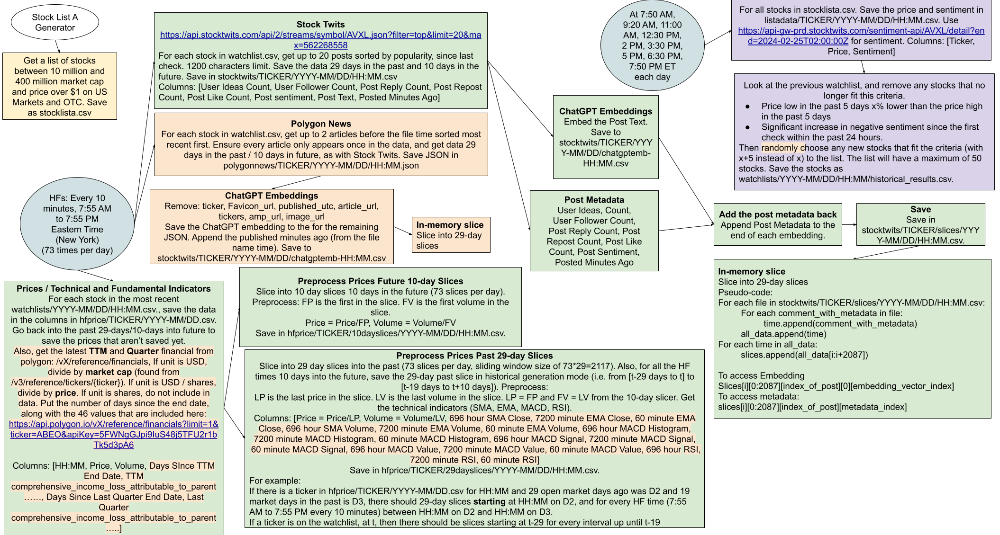

# Stock Twits Scrapper



## Running the Stock Twits Engine

### On Linux

1. Install miniconda:
```bash
mkdir -p ~/miniconda3
wget https://repo.anaconda.com/miniconda/Miniconda3-latest-Linux-x86_64.sh -O ~/miniconda3/miniconda.sh
bash ~/miniconda3/miniconda.sh -b -u -p ~/miniconda3
rm -rf ~/miniconda3/miniconda.sh
~/miniconda3/bin/conda init bash
~/miniconda3/bin/conda init zsh
```
2. Install poetry

```bash
sudo apt update
sudo apt install pipx
pipx ensurepath
sudo pipx ensurepath --global
pipx install poetry
```

3. Create the Environment and Install the Packages

```bash
conda create -n stocktwit python=3.9.19
conda activate stocktwit
poetry install
```


4. Create the .env file as follow
```bash
BRIGHT_DATA_HOST = 'brd.superproxy.io'
BRIGHT_DATA_PORT = 22225
BRIGHT_DATA_USERNAME = 'brd-customer-hl_35eb9f6d-zone-stocktwits1'
BRIGHT_DATA_PASSWORD = '' # replace with BRIGHT_DATA_PASSWORD
LOG_LEVEL='INFO'
OPENAI_API_KEY='' # replace with OPENAI_API_KEY
OPENAI_MODEL_NAME='text-embedding-ada-002'
POLYGON_API_KEY='' # replace with POLYGON_API_KEY
```
5. Create data directory

```bash
mkdir -p data/stocktwits
```


6. Start the Engine (Real or Historical Monitoring) for StockTwits or the WatchList Generator

    ### WatchList Generation for one day (Only run this if you have created watch list for previous day otherwise it will raise error and make sure you have created `stocklista` using [this](examples/stocklista.py))
    - If you want watchlist generation to run for a specific day only then you will make `--day` `2023-01-03` and `--n` `n`
    
    ```bash
    python main.py --type watchlist --day '2023-01-03' --all n
    ```

    ### WatchList Generation from start.
    - If `--all` is `y` then watchlist generation will start from the very start i.e `2023-01-03`

    ```bash
    python main.py --type watchlist --all y
    ```


    ### Real-Time Monitoring Server. 
    - This will start the real-time server, checking if NYSE market is opened or not. If it is opened it will start getting the real-time data.
    
    ```bash
    python main.py --type real
    ```

    ### Historical Generation for one day.
    - If you want historical generation to run for a specific day only then you will make `--day` `2023-01-03` and `--n` `n`

    ```bash
    python main.py --type history --day '2023-01-03' --all n
    ```

    ### Historical Generation from start.
    - If `--all` is `y` then historical generation will start from the very start i.e `2023-01-03`

    ```bash
    python main.py --type history --all y
    ```

    ### Indicators Generation
    - If you want historical generation to run for a specific day only then you will make `--day` `2023-01-03` and `--n` `n`

    ### to generate indicators for a specific ticker
    ```bash
    python main.py --type indicators --ticker MSFT
    ```

    ### to generate indicators for all tickers
    ```bash
    python main.py --type indicators --all y
    ```

    ### Update stocklista.csv with the tickers that are not in the list and you want to generate data for
    ```bash
    python main.py --type fundamentals --update y
    ```


### Important Scripts you need to run:

#### Generate the `stocklista.csv`. See [example](examples/stocklista.py)

```python

import os
import sys

sys.path.insert(0, os.path.join(os.getcwd()))
from stock_twits.watchlists import extract_stock_list
extract_stock_list()

```

#### Using the In-Memory Slicer for Posts Data. See [example](examples/slice.py)

```python

import os
import sys

sys.path.insert(0, os.path.join(os.getcwd()))
from stock_twits.posts.slicer import create_slicer

# Create an in-memory slicer. If no argument is provided, it starts from '2023-1-1'.
# Otherwise, you can provide a starting date for the slices.
in_memory_slicer = create_slicer()
# Print the first slice, which contains data for 2088 points.
# First 1536 dimensions are the embedding and last 6 are the metadata points
print(in_memory_slicer[0][0:2088])

```

## Notes:
    -  I need to check that 1.0 error that you have send
   Done: Store the comments data for t-29 and t+10 when you are on t. Making sure that you don't repeat the files. You don't need to create a different folder. All of the data should be in: stocktwits/<TICKER>/HH:MM.csv
    Done: We no longer need slices folder for the stocktwits data.
    - Backfilling for the first null values.

    